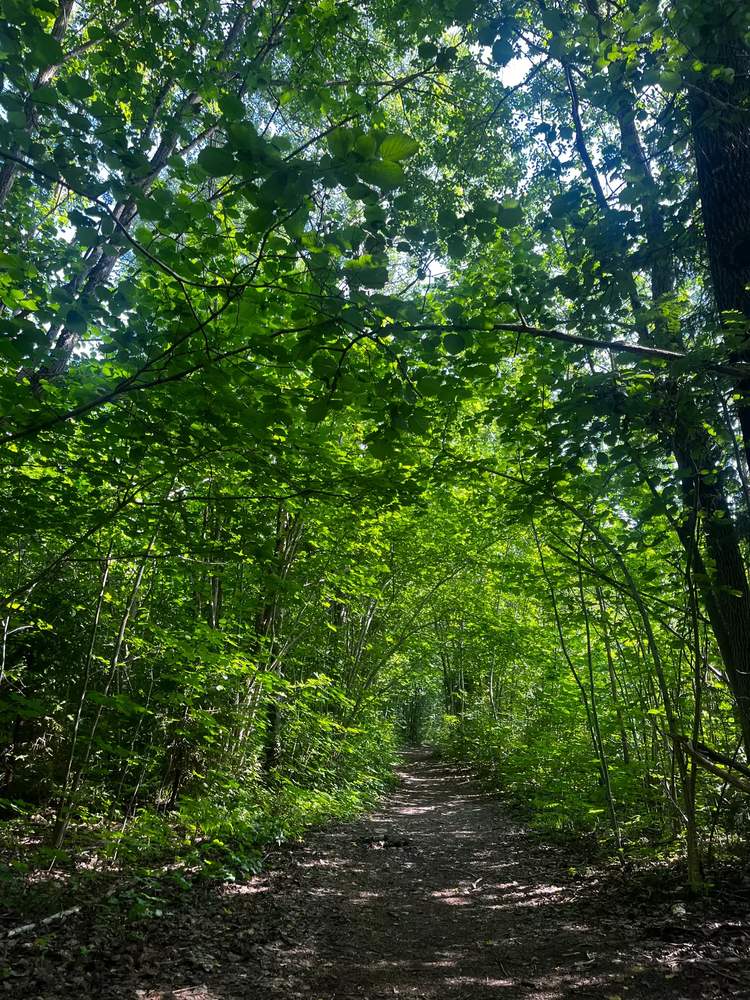

---
# ─────────────────────────────────────────────────────────────────────────────
#  EJEMPLO DE AVENTURA — NO SE PUBLICA
#  Esta carpeta empieza por "_", así que Quarto la ignora: no sale en la web ni
#  en la lista de Aventuras. Sirve de referencia para crear las de verdad.
#
#  Para crear una aventura nueva no copies esta carpeta: usa
#      ./web aventura "Título" --lugar "Lugar"
#  que crea aventuras/<año>/<mes>-<nombre>/ con todo preparado.
# ─────────────────────────────────────────────────────────────────────────────

title: "Título de la aventura"                 # lo que se ve en la tarjeta y arriba de la crónica
description: "Una línea de resumen."           # texto corto de la tarjeta de la lista
date: 2025-07-19                               # ordena la lista (la más reciente primero)
image: fotos/portada.webp                      # foto de la tarjeta; la genera ./web fotos
lugar: "Vintrosa–Hidinge, Suecia"              # aparece con el icono 📍
coordenadas: "59°15′N 14°56′E"                 # opcional; en grados y minutos
# datos: [12 km, 250 m de desnivel, 2 h 30 min]   # opcional: cifras del reto, salen como píldoras
---

Aquí va el texto de la aventura: cómo surgió, qué pasó por el camino, qué te llevaste.
Se escribe en Markdown normal: **negrita**, *cursiva*, [enlaces](https://…), listas…

<!-- La galería la escribe sola "./web fotos <carpeta>" entre estas dos marcas -->
<!-- fotos:inicio -->
{group="galeria"}
<!-- fotos:fin -->

<!--
Vídeo de YouTube (se incrusta en modo de privacidad mejorada, sin cookies hasta darle al play):



Fotos: guarda las originales (del móvil, tal cual) en _originales/ y ejecuta desde la raíz de la web
  ./web fotos aventuras/<año>/<mes>-<nombre>            (opciones: --portada 3  --encuadre abajo)
El script quita el GPS, gira, corrige el color, comprime, crea la portada y añade la galería aquí.
-->
